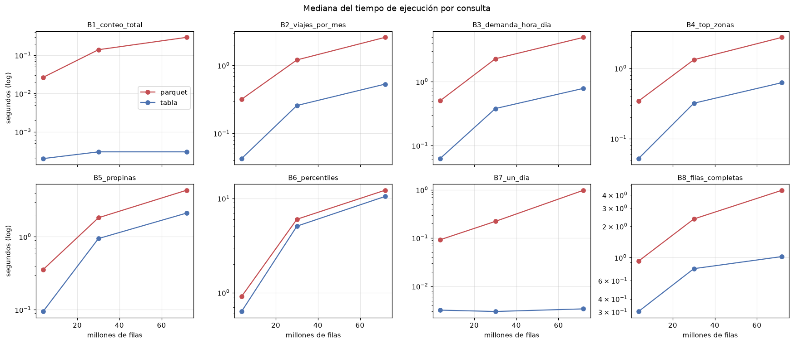

# Ejercicio 6 — Parquet versus tablas DuckDB

| Pieza | Archivo |
|---|---|
| Construcción de la tabla materializada (6.2) | [`scripts/build_database.py`](../scripts/build_database.py) → `data/processed/taxi.duckdb` |
| Consultas del benchmark (6.3, 6.8) | [`sql/06_benchmark.sql`](../sql/06_benchmark.sql) |
| Script del benchmark (6.4–6.6) | [`scripts/benchmark.py`](../scripts/benchmark.py) |
| Resultados (6.7) | [`docs/resultados/06_benchmark.md`](resultados/06_benchmark.md), [`06_benchmark.csv`](resultados/06_benchmark.csv), [`06_benchmark_carga.csv`](resultados/06_benchmark_carga.csv), log en `docs/evidencia/benchmark_2024_2026.log` |
| Gráficas | [`notebooks/06_benchmark.ipynb`](../notebooks/06_benchmark.ipynb), `docs/figuras/06_*.png` |

```bash
docker compose exec lab python scripts/build_database.py   # 6.2: base completa para el tablero
docker compose exec lab python scripts/benchmark.py        # 6.4-6.7: ~10 min
```

## Diseño del experimento

**Comparación válida (misma consulta, mismo resultado).** Las vistas se separaron en dos capas:

- `sql/00_vistas.sql` define `trips` y `zones` **sobre los Parquet**.
- `sql/01_vistas_analisis.sql` define `trips_clean` y los catálogos **sobre `trips`/`zones`**,
  sin importar si son vistas o tablas.

`build_database.py` ejecuta la capa 00 en memoria, materializa `CREATE TABLE trips AS SELECT * FROM trips`
(y `zones`) dentro de un archivo `.duckdb` y vuelve a crear la capa 01 dentro de ese archivo.
Así **el texto SQL de cada consulta es idéntico** en ambas estrategias y la única diferencia es
el almacenamiento. El script además compara los resultados: **las 8 consultas devolvieron
exactamente el mismo resultado** en las dos estrategias y los tres escenarios.

**Consultas (6.3).** Ocho consultas representativas del análisis, elegidas para cubrir
patrones de acceso distintos:

| Id | Consulta | Origen | Patrón |
|---|---|---|---|
| B1 | `COUNT(*)` de `trips` | Ej. 3 | solo metadatos |
| B2 | viajes e ingreso por mes | `viajes_por_mes` (Ej. 4) | agregación sobre 2–3 columnas + filtros de limpieza |
| B3 | heatmap hora × día | `demanda_hora_dia` | `COUNT DISTINCT` + join |
| B4 | top zonas | `top_zonas_origen` | join con dimensión + ventana |
| B5 | propinas con tarjeta | `propinas` | filtro + mediana |
| B6 | percentiles de 3 variables | `percentiles_distancia_duracion` | cálculo pesado (cuantiles exactos sobre ~200 M de valores) |
| B7 | estadísticas de un solo día | nueva | filtro muy selectivo |
| B8 | 100 mil filas completas más caras | nueva | lectura de casi todas las columnas + ordenamiento |

**Cantidades de datos (6.6).** Tres escenarios con los archivos ya descargados:
`1_mes` (enero 2026, 3.8 M filas), `2026` (8 meses, 30 M) y `2024+2026` (20 meses, 72 M).
El escenario `todos` se agrega automáticamente cuando existe 2025 (Ej. 8).

**Medición (6.5).** Cada estrategia usa una conexión nueva; cada consulta se ejecuta una vez
("primera ejecución", reportada aparte) y luego 5 veces; se reporta la **mediana** de esas 5.
Entorno: Docker Desktop sobre Windows 11 (WSL2), 16 hilos, 16 GB RAM, DuckDB 1.5.5. Los datos
viven en el disco de Windows montado en el contenedor. Antes de la primera ejecución los
archivos ya estaban en la caché del sistema operativo (no se puede vaciar desde el contenedor),
así que la "primera ejecución" mide la caché de DuckDB, no la lectura en frío del disco.

## 6.7 Resultados

### Costo de materializar

| Escenario | Archivos | Filas | Parquet (MiB) | DuckDB (MiB) | Tiempo de carga (s) |
|---|---:|---:|---:|---:|---:|
| 1_mes | 2 | 3,765,161 | 62 | 102 | 2.3 |
| 2026 | 16 | 30,040,469 | 496 | 816 | 9.6 |
| 2024+2026 | 40 | 71,870,407 | 1,172 | 1,940 | 31.3 |

### Tiempo por consulta (mediana de 5, segundos)

| Consulta | 1 mes Parquet | 1 mes tabla | ×| 2026 Parquet | 2026 tabla | × | 2024+26 Parquet | 2024+26 tabla | × |
|---|---:|---:|---:|---:|---:|---:|---:|---:|---:|
| B1 conteo | 0.026 | 0.0002 | 132 | 0.140 | 0.0003 | 466 | 0.294 | 0.0003 | 980 |
| B2 por mes | 0.318 | 0.043 | 7.5 | 1.206 | 0.257 | 4.7 | 2.590 | 0.531 | 4.9 |
| B3 hora×día | 0.501 | 0.062 | 8.0 | 2.282 | 0.379 | 6.0 | 4.936 | 0.785 | 6.3 |
| B4 top zonas | 0.343 | 0.052 | 6.6 | 1.323 | 0.319 | 4.1 | 2.751 | 0.626 | 4.4 |
| B5 propinas | 0.355 | 0.095 | 3.7 | 1.823 | 0.946 | 1.9 | 4.343 | 2.111 | 2.1 |
| B6 percentiles | 0.911 | 0.632 | 1.4 | 6.015 | 5.080 | 1.2 | 12.214 | 10.495 | 1.2 |
| B7 un día | 0.092 | 0.003 | 29 | 0.222 | 0.003 | 74 | 0.982 | 0.003 | 289 |
| B8 filas completas | 0.924 | 0.303 | 3.1 | 2.353 | 0.782 | 3.0 | 4.448 | 1.023 | 4.3 |
| **Suma** | **3.47** | **1.19** | **2.9** | **15.36** | **7.77** | **2.0** | **32.56** | **15.58** | **2.1** |

(× = tiempo Parquet / tiempo tabla.) Primera ejecución y CSV completo en `docs/resultados/06_benchmark.md`.



## 6.9 Análisis de las diferencias

1. **La tabla fue más rápida en todas las consultas**, pero la ventaja depende mucho del tipo de
   consulta: de 1.2× (percentiles) a ~1000× (conteo). En el conjunto de las 8 consultas la tabla
   es 2–3× más rápida.
2. **Consultas que dependen de metadatos o de filtros selectivos (B1, B7): ventaja enorme y
   creciente.** La tabla responde en ~0.3 ms y ~3 ms *sin importar el tamaño*:
   - `COUNT(*)` se lee del catálogo de la base.
   - Para "un solo día", DuckDB guarda min/max por bloque de ~122 mil filas (*zonemaps*) y, como
     los datos se insertaron en orden de archivo (mes), descarta casi todos los bloques sin leerlos.
   Con Parquet, en cambio, **hay que abrir el footer de cada archivo** antes de decidir qué leer:
   el costo crece con el número de archivos (2 → 16 → 40) aun si no se lee ningún dato.
   Parquet también tiene estadísticas por *row group*, pero sus row groups son grandes (~1 M de
   filas) y su lectura implica abrir y validar cada archivo.
3. **Agregaciones típicas de análisis (B2–B4, B8): 3–8×.** Con Parquet, cada ejecución vuelve a
   **descomprimir y decodificar** (Snappy/zstd + diccionarios) las columnas usadas. En la tabla
   DuckDB los bloques usan compresión ligera propia, ya están en el formato interno del motor y,
   tras la primera lectura, **quedan en el buffer pool de DuckDB en memoria**. Eso se ve en la
   "primera ejecución": B2 sobre la tabla tarda 2.56 s la primera vez y 0.53 s después, mientras
   con Parquet la primera y la mediana son casi iguales (2.75 vs 2.59 s) porque DuckDB no
   guarda en caché el Parquet decodificado.
4. **Consultas limitadas por cálculo (B6, B5): ventaja pequeña (1.2–2×).** Calcular cuantiles
   exactos o medianas exige ordenar cientos de millones de valores; ese trabajo es el mismo en
   ambas estrategias y domina el tiempo. Optimizar el almacenamiento no ayuda cuando el
   cuello de botella es la CPU.
5. **Escalamiento.** Ambas estrategias crecen aproximadamente lineal con las filas en las consultas
   que recorren los datos (de 3.8 M a 72 M de filas el tiempo crece ~8–13×). La aceleración
   relativa de la tabla se mantiene estable (≈2× en total) para 30 M y 72 M de filas; con 1 mes
   la tabla gana más porque los costos fijos de abrir archivos pesan proporcionalmente más.
   B1 y B7 son la excepción: con tabla son constantes, con Parquet crecen con los archivos.
6. **Costo de la tabla.** Materializar 72 M de filas tomó 31 s y la base ocupa **1.66× el espacio
   de los Parquet** (1.9 GB vs 1.2 GB): la compresión de Parquet es más agresiva. El tiempo de
   carga se recupera tras ~2 ejecuciones del conjunto de consultas (ahorro de 17 s por ronda
   con 72 M de filas). Además la tabla es una **copia**: hay que reconstruirla cada vez que llegan
   archivos nuevos y solo admite un proceso escritor a la vez.
7. Las diferencias absolutas son pequeñas para un humano (≤ 12 s en el peor caso con Parquet)
   gracias a que DuckDB lee Parquet de forma columnar y en paralelo; con Pandas cargar estos 72 M
   de filas en memoria no sería viable en esta máquina (ver Ej. 9).

## 6.10 ¿Cuándo usar cada estrategia?

**Consultar Parquet directamente conviene cuando:**
- los datos **llegan continuamente** como archivos (como aquí, un archivo por mes): el nuevo archivo
  se consulta de inmediato, sin proceso de carga ni copia desactualizada;
- el análisis es **exploratorio o se ejecuta pocas veces** (no se amortiza la carga);
- el **almacenamiento** importa (Parquet ocupa ~40% menos) o los archivos son compartidos por
  otras herramientas (Spark, pandas, Polars, un *data lake* en S3);
- las consultas son pesadas en cálculo (B6), donde la tabla casi no ayuda;
- se quiere una sola fuente de verdad inmutable (`data/raw`) y reproducibilidad.

**Materializar una tabla DuckDB conviene cuando:**
- las mismas consultas se ejecutan **muchas veces** sobre datos que cambian poco: un **tablero**
  (Ej. 7), reportes recurrentes, una API;
- hay **filtros selectivos** (por fecha, zona) o conteos que se benefician de zonemaps y del catálogo;
- se necesita **latencia baja e interactiva** (milisegundos en vez de segundos);
- se aplican transformaciones costosas que conviene calcular una sola vez (normalizar esquemas,
  unir yellow + green, limpiar) y reutilizar;
- hay muchos archivos pequeños (el costo por archivo de Parquet domina).

**Decisión en este proyecto:** la exploración y la validación (Ej. 3–5, 8) consultan Parquet
directamente — es lo que permite agregar años sin pasos extra — y el **tablero de Metabase usa la
tabla materializada** `taxi.duckdb`, que se reconstruye con un comando (`build_database.py`) cada
vez que se incorporan archivos. Es el patrón habitual *lake + capa servida*: Parquet como fuente de
verdad y una tabla derivada, desechable, optimizada para lecturas repetidas.
