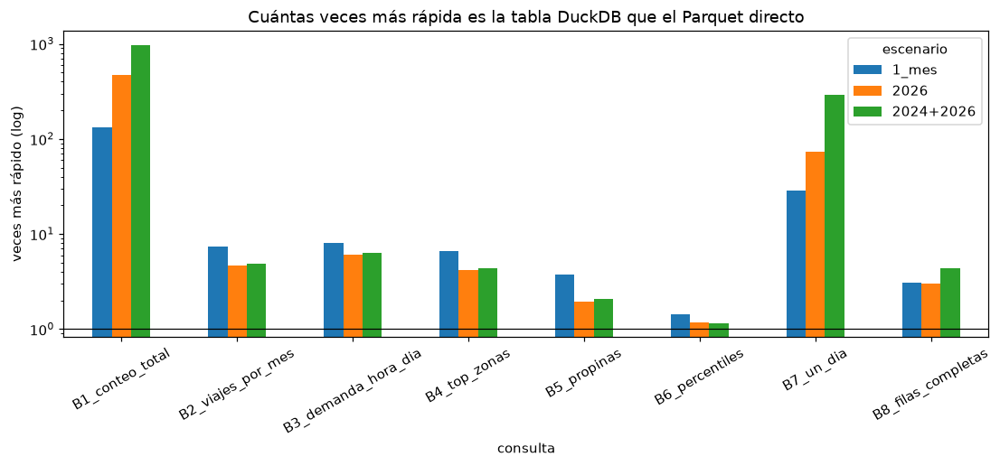

# Ejercicio 6 — Parquet versus tablas DuckDB

| Pieza | Archivo |
|---|---|
| Construcción de la tabla materializada (6.2) | [`scripts/build_database.py`](../scripts/build_database.py) → `data/processed/taxi.duckdb` |
| Consultas del benchmark (6.3, 6.8) | [`sql/06_benchmark.sql`](../sql/06_benchmark.sql) |
| Script del benchmark (6.4–6.6) | [`scripts/benchmark.py`](../scripts/benchmark.py) |
| Resultados (6.7) | [`docs/resultados/06_benchmark.md`](resultados/06_benchmark.md), [`06_benchmark.csv`](resultados/06_benchmark.csv), [`06_benchmark_carga.csv`](resultados/06_benchmark_carga.csv), log en `docs/evidencia/benchmark_2024_2026.log` |
| Gráficas | [`notebooks/06_benchmark.ipynb`](../notebooks/06_benchmark.ipynb), `docs/figuras/06_*.png` |

```bash
docker compose exec lab python scripts/build_database.py   # 6.2: base completa para el tablero
docker compose exec lab python scripts/benchmark.py        # 6.4-6.7: ~10 min
```

## Diseño del experimento

**Comparación válida (misma consulta, mismo resultado).** Las vistas se separaron en dos capas:

- `sql/00_vistas.sql` define `trips` y `zones` **sobre los Parquet**.
- `sql/01_vistas_analisis.sql` define `trips_clean` y los catálogos **sobre `trips`/`zones`**,
  sin importar si son vistas o tablas.

`build_database.py` ejecuta la capa 00 en memoria, materializa `CREATE TABLE trips AS SELECT * FROM trips`
(y `zones`) dentro de un archivo `.duckdb` y vuelve a crear la capa 01 dentro de ese archivo.
Así **el texto SQL de cada consulta es idéntico** en ambas estrategias y la única diferencia es
el almacenamiento. El script además compara los resultados: **las 8 consultas devolvieron
exactamente el mismo resultado** en las dos estrategias y los cuatro escenarios.

**Consultas (6.3).** Ocho consultas representativas del análisis, elegidas para cubrir
patrones de acceso distintos:

| Id | Consulta | Origen | Patrón |
|---|---|---|---|
| B1 | `COUNT(*)` de `trips` | Ej. 3 | solo metadatos |
| B2 | viajes e ingreso por mes | `viajes_por_mes` (Ej. 4) | agregación sobre 2–3 columnas + filtros de limpieza |
| B3 | heatmap hora × día | `demanda_hora_dia` | `COUNT DISTINCT` + join |
| B4 | top zonas | `top_zonas_origen` | join con dimensión + ventana |
| B5 | propinas con tarjeta | `propinas` | filtro + mediana |
| B6 | percentiles de 3 variables | `percentiles_distancia_duracion` | cálculo pesado (cuantiles exactos sobre cientos de millones de valores) |
| B7 | estadísticas de un solo día | nueva | filtro muy selectivo |
| B8 | 100 mil filas completas más caras | nueva | lectura de casi todas las columnas + ordenamiento |

**Cantidades de datos (6.6).** Tres escenarios con los archivos ya descargados:
`1_mes` (enero 2026, 3.8 M filas), `2026` (8 meses, 30 M), `2024+2026` (20 meses, 72 M) y `todos` (2024–2026, 32 meses, 121 M), este último agregado
automáticamente al descargar 2025 (Ej. 8).

**Medición (6.5).** Cada estrategia usa una conexión nueva; cada consulta se ejecuta una vez
("primera ejecución", reportada aparte) y luego 5 veces; se reporta la **mediana** de esas 5.
Entorno: Docker Desktop sobre Windows 11 (WSL2), 16 hilos, 16 GB RAM, DuckDB 1.5.5. Los datos
viven en el disco de Windows montado en el contenedor. Antes de la primera ejecución los
archivos ya estaban en la caché del sistema operativo (no se puede vaciar desde el contenedor),
así que la "primera ejecución" mide la caché de DuckDB, no la lectura en frío del disco.

## 6.7 Resultados

Ejecución final con los tres años descargados (log: `docs/evidencia/benchmark_3_anios.log`;
la primera ejecución, con solo 2024+2026, está en `docs/evidencia/benchmark_2024_2026.log` y dio
las mismas conclusiones).

### Costo de materializar

| Escenario | Archivos | Filas | Parquet (MiB) | DuckDB (MiB) | Tiempo de carga (s) |
|---|---:|---:|---:|---:|---:|
| 1_mes | 2 | 3,765,161 | 62 | 102 | 2.6 |
| 2026 | 16 | 30,040,469 | 496 | 816 | 10.2 |
| 2024+2026 | 40 | 71,870,407 | 1,172 | 1,940 | 21.9 |
| todos (2024–2026) | 64 | 121,184,384 | 1,977 | 3,306 | 47.4 |

### Tiempo por consulta (mediana de 5, segundos)

| Consulta | 1 mes P | 1 mes T | × | 2026 P | 2026 T | × | 2024+26 P | 2024+26 T | × | todos P | todos T | × |
|---|---:|---:|---:|---:|---:|---:|---:|---:|---:|---:|---:|---:|
| B1 conteo | 0.080 | 0.0002 | 399 | 0.178 | 0.0004 | 446 | 0.286 | 0.0002 | 1430 | 1.141 | 0.0004 | 2853 |
| B2 por mes | 0.380 | 0.044 | 8.7 | 1.280 | 0.269 | 4.8 | 2.629 | 0.603 | 4.4 | 4.230 | 0.903 | 4.7 |
| B3 hora×día | 0.529 | 0.062 | 8.5 | 2.594 | 0.381 | 6.8 | 4.943 | 0.840 | 5.9 | 8.087 | 1.682 | 4.8 |
| B4 top zonas | 0.321 | 0.052 | 6.2 | 1.437 | 0.290 | 4.9 | 2.804 | 0.894 | 3.1 | 4.415 | 1.317 | 3.4 |
| B5 propinas | 0.365 | 0.094 | 3.9 | 1.917 | 0.866 | 2.2 | 4.418 | 2.222 | 2.0 | 6.490 | 3.290 | 2.0 |
| B6 percentiles | 1.099 | 0.851 | 1.3 | 8.065 | 7.223 | 1.1 | 16.844 | 15.155 | 1.1 | 29.340 | 27.221 | 1.1 |
| B7 un día | 0.088 | 0.003 | 34 | 0.221 | 0.003 | 76 | 0.868 | 0.004 | 241 | 0.881 | 0.004 | 245 |
| B8 filas completas | 0.928 | 0.327 | 2.8 | 2.360 | 0.842 | 2.8 | 4.247 | 1.098 | 3.9 | 6.635 | 1.513 | 4.4 |
| **Suma** | **3.79** | **1.43** | **2.6** | **18.05** | **9.87** | **1.8** | **37.04** | **20.82** | **1.8** | **61.22** | **35.93** | **1.7** |

(P = Parquet directo, T = tabla DuckDB, × = P / T.) Primera ejecución y CSV completo en
[`docs/resultados/06_benchmark.md`](resultados/06_benchmark.md).




## 6.9 Análisis de las diferencias

1. **La tabla fue más rápida en todas las consultas y todos los tamaños**, pero la ventaja depende
   del tipo de consulta: de 1.1× (percentiles) a casi 3000× (conteo). En el conjunto de las 8
   consultas la tabla es 1.7–2.6× más rápida.
2. **Consultas que dependen de metadatos o de filtros selectivos (B1, B7): ventaja enorme y
   creciente.** La tabla responde en < 1 ms y ~4 ms *sin importar el tamaño*:
   - `COUNT(*)` se lee del catálogo de la base.
   - Para "un solo día", DuckDB guarda min/max por bloque de ~122 mil filas (*zonemaps*) y, como
     los datos se insertaron en orden de archivo (mes), descarta casi todos los bloques sin leerlos.
   Con Parquet hay que **abrir el footer de cada archivo** antes de decidir qué leer: el costo
   crece con el número de archivos (2 → 64: B1 de 0.08 a 1.1 s, B7 de 0.09 a 0.9 s) aunque casi no
   se lean datos. Parquet también tiene estadísticas por *row group*, pero sus row groups son
   grandes (~1 M de filas) y abrir y validar cada archivo tiene un costo fijo.
3. **Agregaciones típicas de análisis (B2–B4, B8): 3–9×.** Con Parquet, cada ejecución vuelve a
   **descomprimir y decodificar** (Snappy/zstd + diccionarios) las columnas usadas. En la tabla
   DuckDB los bloques ya están en el formato interno del motor con compresión ligera y, tras la
   primera lectura, **quedan en el buffer pool de DuckDB en memoria**. Se ve en la "primera
   ejecución": con 121 M filas, B2 sobre la tabla tarda 4.35 s la primera vez y 0.90 s después,
   mientras con Parquet la primera y la mediana son iguales (4.25 vs 4.23 s), porque DuckDB no
   guarda en caché el Parquet decodificado. **En una consulta que se ejecuta una sola vez, la
   tabla y el Parquet tardan lo mismo**; la ventaja de la tabla aparece al repetir.
4. **Consultas limitadas por cálculo (B6, B5): ventaja pequeña (1.1–2×).** Calcular cuantiles
   exactos o medianas exige ordenar cientos de millones de valores; ese trabajo es el mismo en
   ambas estrategias y domina el tiempo. Optimizar el almacenamiento no ayuda cuando el cuello de
   botella es la CPU. (B6 se reescribió entre la primera y la última ejecución para no agotar la
   memoria con 3 años, ver Ej. 8; la nueva forma es algo más lenta pero escala.)
5. **Escalamiento.** De 3.8 M a 121 M filas (×32) los tiempos de las consultas que recorren los
   datos crecen ×11–27, es decir, de forma aproximadamente lineal (con algo de ventaja para
   Parquet en archivos pequeños por el paralelismo entre archivos). La aceleración total de la
   tabla es estable (≈1.7–1.8×) a partir de 30 M filas; con 1 mes es mayor (2.6×) porque los costos
   fijos de abrir archivos pesan proporcionalmente más. B1 y B7 son la excepción: con tabla son
   constantes, con Parquet crecen con los archivos.
6. **Costo de la tabla.** Materializar 121 M filas tomó 47 s y la base ocupa **1.67× el espacio
   de los Parquet** (3.3 vs 2.0 GB): la compresión de Parquet es más agresiva. El tiempo de carga se
   recupera tras ~2 rondas del conjunto de consultas (ahorro de 25 s por ronda). Además la tabla
   es una **copia**: hay que reconstruirla cada vez que llegan archivos y solo admite un proceso
   escritor a la vez (el tablero la abre en solo lectura).
7. **Variabilidad.** Hubo ruido de medición (p. ej. B1 Parquet con todos los años: primera 0.46 s,
   mediana 1.14 s), propio de un entorno Docker sobre Windows con los datos en un disco montado.
   Por eso se reporta la mediana de 5 ejecuciones y se repitió el benchmark completo dos veces con
   conclusiones idénticas.
8. Las diferencias absolutas son tolerables para un humano (≤ 30 s en el peor caso con Parquet sobre
   121 M filas) gracias a que DuckDB lee Parquet de forma columnar y en paralelo; cargar esas filas en
   pandas no sería viable en esta máquina (Ej. 9.4).

## 6.10 ¿Cuándo usar cada estrategia?

**Consultar Parquet directamente conviene cuando:**
- los datos **llegan continuamente** como archivos (como aquí, un archivo por mes): el nuevo archivo
  se consulta de inmediato, sin proceso de carga ni copia desactualizada;
- el análisis es **exploratorio o se ejecuta pocas veces** (no se amortiza la carga);
- el **almacenamiento** importa (Parquet ocupa ~40% menos) o los archivos son compartidos por
  otras herramientas (Spark, pandas, Polars, un *data lake* en S3);
- las consultas son pesadas en cálculo (B6), donde la tabla casi no ayuda;
- se quiere una sola fuente de verdad inmutable (`data/raw`) y reproducibilidad.

**Materializar una tabla DuckDB conviene cuando:**
- las mismas consultas se ejecutan **muchas veces** sobre datos que cambian poco: un **tablero**
  (Ej. 7), reportes recurrentes, una API;
- hay **filtros selectivos** (por fecha, zona) o conteos que se benefician de zonemaps y del catálogo;
- se necesita **latencia baja e interactiva** (milisegundos en vez de segundos);
- se aplican transformaciones costosas que conviene calcular una sola vez (normalizar esquemas,
  unir yellow + green, limpiar) y reutilizar;
- hay muchos archivos pequeños (el costo por archivo de Parquet domina).

**Decisión en este proyecto:** la exploración y la validación (Ej. 3–5, 8) consultan Parquet
directamente — es lo que permite agregar años sin pasos extra — y el **tablero de Metabase usa la
tabla materializada** `taxi.duckdb`, que se reconstruye con un comando (`build_database.py`) cada
vez que se incorporan archivos. Es el patrón habitual *lake + capa servida*: Parquet como fuente de
verdad y una tabla derivada, desechable, optimizada para lecturas repetidas.
