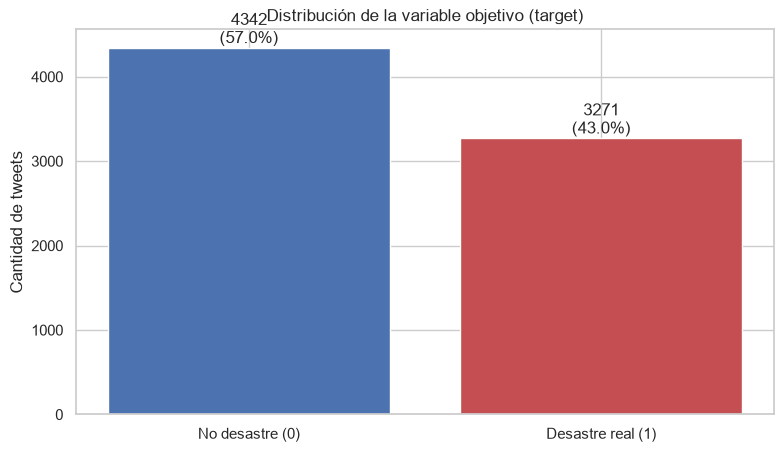
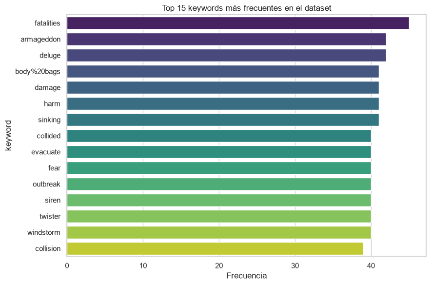
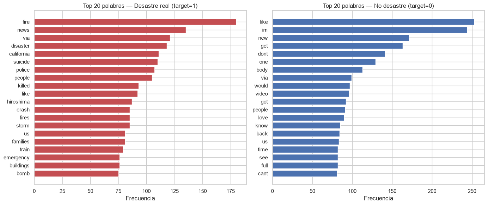
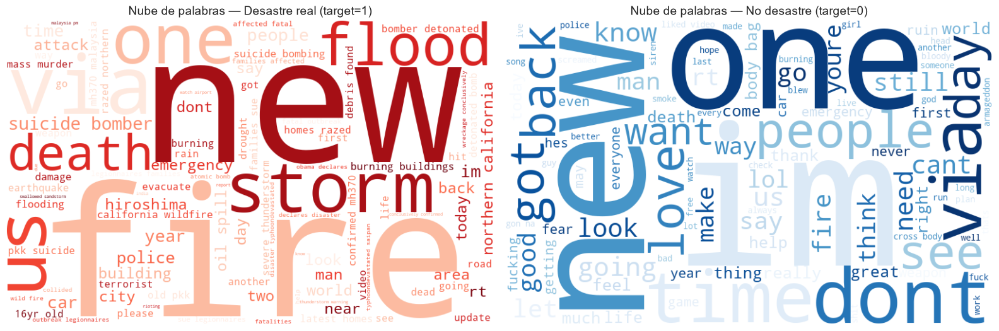
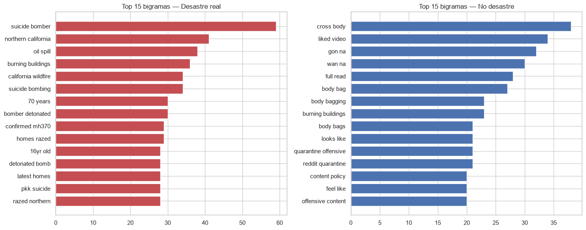
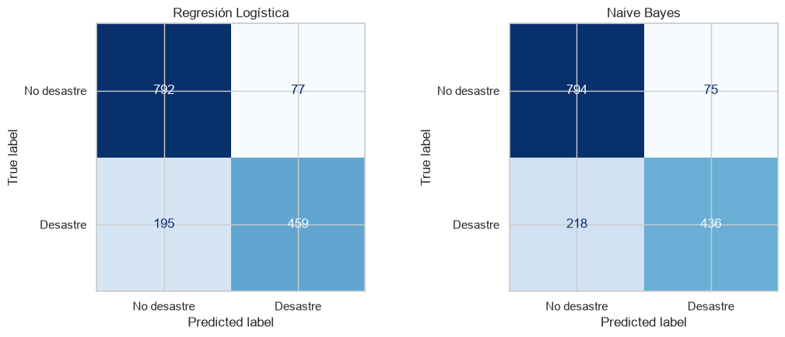
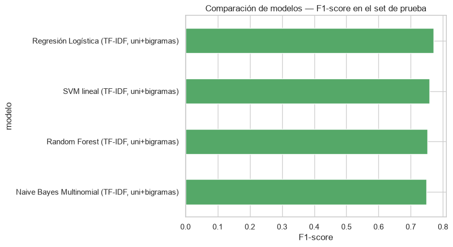
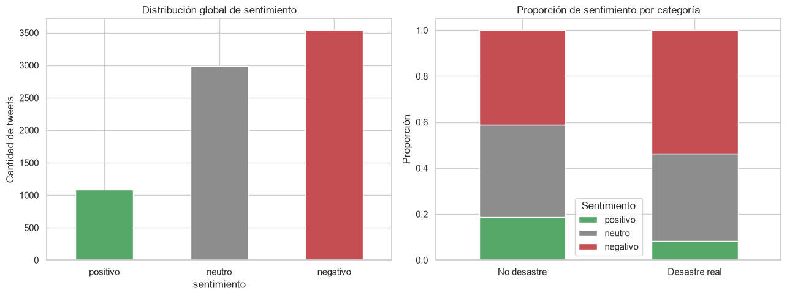
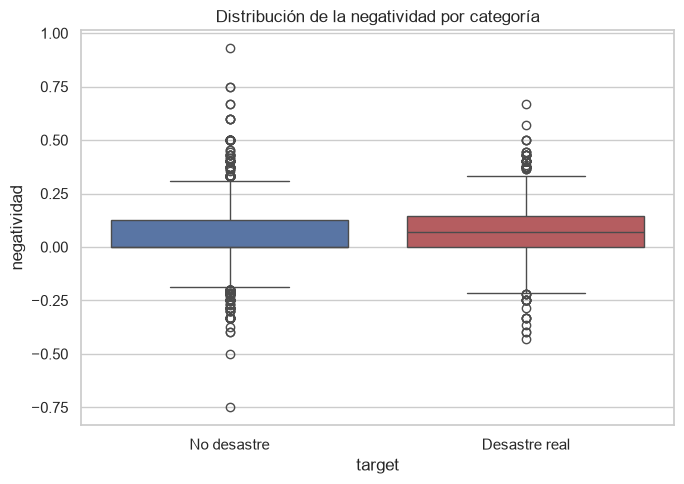
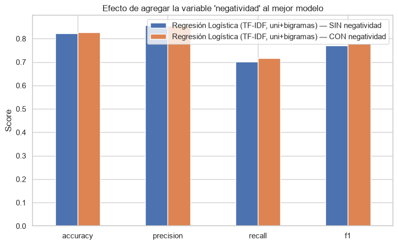

# Laboratorio 5 — Clasificación de tweets usando minería de texto

**Universidad del Valle de Guatemala**
Facultad de Ingeniería — Departamento de Ciencias de la Computación
CC3084 – Data Science · Semestre II – 2026

**Integrantes:** [completar nombres y carnés de los integrantes del grupo]
**Fecha de entrega:** 30 de agosto de 2026
**Repositorio del proyecto:** https://github.com/DavidDominguez-11/DS-Lab1
**Notebook reproducible:** `Laboratorio5_avance.ipynb` (en la raíz del repositorio)

---

> **Nota para quien convierta este documento a Word:** este archivo es el contenido completo del informe. Cada referencia `` debe insertarse como imagen centrada en el punto donde aparece, con una leyenda tipo "Figura N: descripción" debajo. Los encabezados `#`, `##`, `###` deben mapearse a estilos Título 1, Título 2 y Título 3 respectivamente. Las tablas en formato Markdown deben convertirse a tablas nativas de Word con encabezado en negrita. Sugerido: portada con el bloque de título anterior, tabla de contenido automática después de la portada, y numeración de páginas. Los bloques de código deben usar fuente monoespaciada (p. ej. Consolas 9-10pt) con fondo gris claro.

---

## 1. Introducción y objetivo

Twitter (y las redes sociales de formato corto en general) se ha convertido en una fuente de información en tiempo real durante emergencias y desastres. Sin embargo, el lenguaje que la gente usa para describir un desastre real (p. ej. *"la casa está en llamas"*) es prácticamente indistinguible, a nivel de palabras sueltas, del lenguaje figurado que usamos a diario (p. ej. *"esta canción está que arde"*). Esto hace que la detección automática de tweets sobre desastres reales sea un problema interesante de minería de texto y clasificación.

El objetivo de este laboratorio es construir un pipeline completo de minería de texto que permita:

1. Limpiar y preprocesar un conjunto de ~7,600 tweets etiquetados.
2. Explorar sus patrones léxicos (frecuencias, n-gramas, nube de palabras).
3. Entrenar y comparar varios modelos de clasificación que determinen si un tweet describe un desastre real o no.
4. Construir una función que clasifique tweets nuevos sin preprocesar.
5. Añadir un componente de análisis de sentimiento (positivo/negativo/neutro) y una variable de "negatividad", evaluando si esta mejora el modelo de clasificación.

## 2. Descripción del dataset

Se utilizó el dataset [Natural Language Processing with Disaster Tweets](https://www.kaggle.com/c/nlp-getting-started) de Kaggle (`train.csv`), compuesto por **7,613 tweets** y **5 columnas**:

| Columna | Descripción |
|---|---|
| `id` | Identificador único del tweet |
| `keyword` | Palabra clave asociada al tweet (puede estar en blanco) |
| `location` | Ubicación declarada por el usuario (puede estar en blanco) |
| `text` | Texto del tweet |
| `target` | Etiqueta: `1` = desastre real, `0` = no desastre |

## 3. Herramientas y metodología

El análisis se realizó en **Python**, dentro de un notebook de Jupyter (`Laboratorio5_avance.ipynb`), usando las siguientes librerías:

| Librería | Uso en el proyecto |
|---|---|
| `pandas`, `numpy` | Carga y manipulación de los datos |
| `matplotlib`, `seaborn` | Visualizaciones y gráficos |
| `nltk` | Stopwords, tokenización y léxico de sentimiento (`opinion_lexicon`) |
| `wordcloud` | Generación de nubes de palabras |
| `scikit-learn` | Vectorización TF-IDF/`CountVectorizer`, modelos de clasificación y métricas |
| `scipy` | Prueba estadística *t* de Welch y álgebra de matrices dispersas |
| `re`, `string` | Limpieza de texto con expresiones regulares |

El entorno completo (versiones exactas de cada paquete) queda documentado en `requirements.txt` en la raíz del repositorio, para garantizar reproducibilidad.

## 4. Análisis exploratorio general

### 4.1. Estructura y valores nulos

El dataset no tiene duplicados de `id` y solo dos columnas presentan valores nulos:

| Columna | Valores nulos | % del total |
|---|---:|---:|
| `keyword` | 61 | 0.80% |
| `location` | 2,533 | 33.27% |
| `text` | 0 | 0.00% |
| `target` | 0 | 0.00% |

**Decisión:** `location` se descarta como predictor directo — además de tener un tercio de valores nulos, es texto libre no normalizado (ciudades reales, países, o ubicaciones inventadas como *"Earth"*, *"everywhere"*, *"in your heart"*), por lo que normalizarla requeriría un proceso de geolocalización fuera del alcance de este laboratorio. `keyword`, en cambio, tiene muy pocos nulos y se analiza en la sección 4.3.

### 4.2. Balance de la variable objetivo


*Figura 1: Distribución de tweets por categoría (target).*

| Categoría | Cantidad | Porcentaje |
|---|---:|---:|
| No desastre (0) | 4,342 | 57.0% |
| Desastre real (1) | 3,271 | 43.0% |

El dataset está **moderadamente desbalanceado** pero no de forma extrema. Esto motivó el uso de F1-score (y no solo accuracy) como métrica principal para comparar modelos, y el uso de muestreo estratificado (`stratify=target`) al dividir entrenamiento/prueba.

### 4.3. Análisis de la variable `keyword`


*Figura 2: Las 15 keywords más frecuentes en el dataset.*

Más interesante que la frecuencia es la **tasa de desastre real** por keyword (proporción de tweets con `target=1` entre los tweets que tienen esa keyword, considerando solo keywords con al menos 10 apariciones):

| Keywords MÁS asociadas a desastre real | Tasa | Keywords MENOS asociadas a desastre real | Tasa |
|---|---:|---|---:|
| `debris` | 100.0% | `aftershock` | 0.0% |
| `derailment` | 100.0% | `body%20bags` | 2.4% |
| `wreckage` | 100.0% | `ruin` | 2.7% |
| `outbreak` | 97.5% | `blazing` | 2.9% |
| `oil%20spill` | 97.4% | `body%20bag` | 3.0% |
| `typhoon` | 97.4% | `electrocute` | 3.1% |
| `suicide%20bombing` | 97.0% | `screaming` | 5.6% |
| `suicide%20bomber` | 96.8% | `traumatised` | 5.7% |
| `bombing` | 93.1% | `panicking` | 6.1% |
| `suicide%20bomb` | 91.4% | `blew%20up` | 6.1% |

**Observación clave:** algunas keywords están casi perfectamente asociadas a una sola clase (`debris`, `derailment`, `wreckage` → siempre desastre real; `aftershock` → casi nunca, a pesar de sonar como palabra de desastre). Esto confirma que **el significado literal de una palabra no garantiza que el tweet hable de un evento real** — el contexto importa, lo cual se retoma en la sección de n-gramas y modelos.

## 5. Limpieza y preprocesamiento del texto

Los tweets son texto ruidoso: contienen URLs, menciones (`@usuario`), hashtags, entidades HTML (`&amp;`), restos de emojis mal codificados y puntuación irregular. Se documenta cada paso de limpieza junto con su justificación.

### 5.1. Pasos aplicados

| # | Paso | Justificación |
|---:|---|---|
| 1 | Minúsculas | Para que `Fire`, `FIRE` y `fire` se traten como el mismo token. |
| 2 | Decodificar entidades HTML (`&amp;`, `&lt;`, `&gt;`, `&quot;`, `&#39;`) | Twitter codifica caracteres especiales como entidades HTML; se restauran a su símbolo real. |
| 3 | Eliminar URLs | No aportan información semántica y son casi únicas por tweet — solo agregan ruido y dimensionalidad. |
| 4 | Eliminar menciones (`@usuario`) | El nombre de usuario mencionado no aporta señal sobre si el tweet describe un desastre. |
| 5 | Eliminar el símbolo `#` conservando la palabra | `#earthquake` → `earthquake`. El término dentro del hashtag sí es relevante. |
| 6 | Eliminar emojis/emoticones | Se retiran para el modelo de bag-of-words / TF-IDF (se reevalúa esta decisión en la sección 11, para el análisis de sentimiento). |
| 7 | Eliminar caracteres de codificación corrupta (mojibake, p. ej. `\x89Û_`) y no-ASCII | Corresponden a errores de encoding de comillas/apóstrofes del dataset original, no a información útil. |
| 8 | Eliminar puntuación | Signos como `.`, `,`, `!`, `?`, `'`, `"` no aportan al modelo de bolsa de palabras. |
| 9 | Colapsar espacios múltiples | Limpieza de formato tras las sustituciones anteriores. |
| 10 | **Conservar los números** | Se decidió NO eliminarlos: el propio enunciado señala el caso de `911`, un token con fuerte señal de emergencia real. Eliminar todos los números perdería esa información. |
| 11 | Tokenización (`nltk.word_tokenize`) | Separar el texto limpio en palabras individuales. |
| 12 | Eliminar stopwords en inglés (`nltk.corpus.stopwords`, 198 palabras) | Artículos, preposiciones y conjunciones tienen frecuencia altísima en ambas clases y no discriminan entre desastre real o no. |

### 5.2. Ejemplos del pipeline aplicado

| Original | Texto limpio | Tokens finales |
|---|---|---|
| *"Our Deeds are the Reason of this #earthquake May ALLAH Forgive us all"* | `our deeds are the reason of this earthquake may allah forgive us all` | `[deeds, reason, earthquake, may, allah, forgive, us]` |
| *"13,000 people receive #wildfires evacuation orders in California"* | `13000 people receive wildfires evacuation orders in california` | `[13000, people, receive, wildfires, evacuation, orders, california]` |
| *"I'm afraid that the tornado is coming to our area..."* | `im afraid that the tornado is coming to our area` | `[im, afraid, tornado, coming, area]` |
| *"Rene Ablaze &amp; Jacinta - Secret 2k13 (Fallen Skies Edit) - Mar 30 2013 https://t.co/7MLMsUzV1Z"* | `rene ablaze jacinta secret 2k13 fallen skies edit mar 30 2013` | `[rene, ablaze, jacinta, secret, 2k13, fallen, skies, edit, mar, 30, 2013]` |

El último ejemplo muestra un caso interesante: la palabra clave `ablaze` (que en el dataset original está asociada mayoritariamente a incendios reales) aparece aquí en un contexto totalmente ajeno a desastres (nombre de un DJ/canción), lo que **ilustra por qué una sola palabra clave no basta** para clasificar correctamente y por qué el contexto (n-gramas) es relevante.

## 6. Frecuencia de palabras (unigramas)

Se calculó la frecuencia de palabras por separado para tweets de desastre real y de no-desastre (sobre tokens sin stopwords).


*Figura 3: Top 20 palabras más frecuentes en cada categoría.*

**Top 10 — Desastre real (target=1):** fire (180), news (135), via (121), disaster (118), california (111), suicide (110), police (107), people (105), killed (93), like (92).

**Top 10 — No desastre (target=0):** like (253), im (244), new (171), get (163), dont (141), one (129), body (113), via (99), would (97), video (96).

**Palabras presentes en el top-20 de ambas categorías:** `us`, `via`, `like`, `people` (solo 4 de 20). Son términos genéricos de Twitter sin carga semántica sobre desastres — buenos candidatos a tratarse como "stopwords del dominio" en un refinamiento futuro.

**¿Qué palabras servirán para un mejor modelo?** Palabras específicas y poco ambiguas de la clase 1 (`fire`, `california`, `suicide`, `killed`, `disaster`, `police`) tienen alto valor discriminativo. En contraste, la clase 0 muestra vocabulario de uso coloquial/figurado (`love`, `body`, `full`, `im`, `dont`) que en varios casos corresponde a usos metafóricos de palabras que también aparecen como keywords de desastre (p. ej. "ablaze" usado como "me encanta algo" y no como incendio real).

**¿Vale la pena explorar bigramas/trigramas?** Sí — se responde con evidencia concreta en la sección 8: muchas expresiones de desastre solo cobran su significado real en combinación con la palabra vecina (`suicide bomber` vs. la palabra aislada `bomb`, que es ambigua).

## 7. Nube de palabras


*Figura 4: Nube de palabras — izquierda: tweets de desastre real; derecha: tweets de no-desastre.*

La nube de palabras confirma visualmente el hallazgo de la sección anterior: el lado de "desastre real" está dominado por sustantivos concretos de eventos (fire, flood, storm, police, killed), mientras que el lado de "no desastre" mezcla vocabulario cotidiano y de uso figurado.

## 8. N-gramas: bigramas

Se generaron bigramas con `CountVectorizer(ngram_range=(2,2))` sobre el texto limpio (sin stopwords) para capturar contexto que los unigramas no reflejan.


*Figura 5: Los 15 bigramas más frecuentes en cada categoría.*

| Top bigramas — Desastre real | Frecuencia | Top bigramas — No desastre | Frecuencia |
|---|---:|---|---:|
| suicide bomber | 59 | cross body | 38 |
| northern california | 41 | liked video | 34 |
| oil spill | 38 | gon na | 32 |
| burning buildings | 36 | wan na | 30 |
| california wildfire | 34 | full read | 28 |
| suicide bombing | 34 | body bag | 27 |
| 70 years | 30 | body bagging | 23 |
| bomber detonated | 30 | burning buildings | 23 |
| confirmed mh370 | 29 | body bags | 21 |
| homes razed | 29 | looks like | 21 |

**Discusión:** los bigramas de la clase de desastre real (`suicide bomber`, `oil spill`, `california wildfire`) son mucho más específicos y accionables que sus unigramas equivalentes, confirmando que el contexto de dos palabras reduce la ambigüedad de términos polisémicos. Curiosamente, `burning buildings` aparece en el top-15 de **ambas** clases (36 vs. 23 veces), lo que demuestra que incluso un bigrama puede ser ambiguo sin más contexto — un límite natural de los modelos de n-gramas frente a modelos que entienden semántica completa de oración. Por esta razón, el modelo de clasificación final usa una representación TF-IDF con **unigramas + bigramas combinados** (`ngram_range=(1,2)`), en lugar de bigramas puros.

## 9. Modelos de clasificación

### 9.1. Preparación de los datos

- **Vectorización:** TF-IDF sobre el texto limpio (`clean_text`), con `ngram_range=(1,2)`, `max_features=10000` y `min_df=2`. El propio vectorizador filtra las stopwords en inglés.
- **División train/test:** 80% / 20% (6,090 tweets de entrenamiento, 1,523 de prueba), **estratificada** por `target` para preservar el balance de clases discutido en la sección 4.2.
- **Tamaño del vocabulario resultante:** 9,031 términos (unigramas + bigramas).

### 9.2. Modelo preliminar

Como primer acercamiento se entrenaron dos modelos base ampliamente usados en clasificación de texto:


*Figura 6: Matrices de confusión de los modelos preliminares (Regresión Logística y Naive Bayes).*

| Modelo | Accuracy | Precision | Recall | F1-score |
|---|---:|---:|---:|---:|
| Regresión Logística | 0.8214 | 0.8563 | 0.7018 | 0.7714 |
| Naive Bayes Multinomial | 0.8076 | 0.8532 | 0.6667 | 0.7485 |

### 9.3. Comparación de varios modelos de clasificación

Se agregaron dos algoritmos adicionales sobre la misma representación TF-IDF: **SVM lineal** (fuerte en espacios dispersos de alta dimensionalidad) y **Random Forest** (para verificar si un ensamble no lineal aporta algo sobre los modelos lineales).


*Figura 7: Comparación de F1-score entre los cuatro modelos evaluados.*

| Modelo | Accuracy | Precision | Recall | F1-score |
|---|---:|---:|---:|---:|
| **Regresión Logística** | **0.8214** | 0.8563 | 0.7018 | **0.7714** |
| SVM lineal | 0.7984 | 0.7812 | 0.7370 | 0.7585 |
| Random Forest | 0.7997 | 0.8035 | 0.7064 | 0.7518 |
| Naive Bayes Multinomial | 0.8076 | 0.8532 | 0.6667 | 0.7485 |

### 9.4. Selección del mejor modelo y manejo del contexto

**Modelo seleccionado: Regresión Logística** sobre TF-IDF (uni+bigramas), por tener el mayor F1-score (0.7714), la métrica más adecuada dado el desbalance moderado de clases (promedia precisión y exhaustividad en vez de premiar solo acertar la clase mayoritaria).

**¿Cómo se aborda el contexto?** El contexto local se incorpora mediante **n-gramas** (`ngram_range=(1,2)`) dentro del vectorizador TF-IDF: el modelo ve tanto palabras sueltas como pares de palabras consecutivas, lo que permite distinguir expresiones como *"suicide bomber"* (desastre) de la palabra aislada *"bomb"* (ambigua, según se vio en las secciones 6 y 8). No se usaron embeddings de palabras ni modelos de lenguaje preentrenados (p. ej. BERT), ya que exceden el alcance del laboratorio, pero se documentan aquí como una extensión natural para capturar contexto semántico más rico en un trabajo futuro.

## 10. Función de clasificación de tweets

Se construyó una función de extremo a extremo, `clasificar_tweet(texto_crudo)`, que recibe el **texto crudo de un tweet (sin preprocesar)** y aplica internamente todo el pipeline de limpieza de la sección 5 antes de vectorizar y predecir con el mejor modelo (Regresión Logística):

```python
def clasificar_tweet(texto_crudo, vectorizer=tfidf, modelo=None):
    """Clasifica un tweet crudo (sin preprocesar) como desastre real o no."""
    if modelo is None:
        modelo = best_model  # Regresión Logística (TF-IDF, uni+bigramas)

    texto_limpio = clean_text(texto_crudo)
    vector = vectorizer.transform([texto_limpio])
    prediccion = int(modelo.predict(vector)[0])
    etiqueta = "Desastre real" if prediccion == 1 else "No desastre"

    resultado = {
        "tweet_original": texto_crudo,
        "tweet_limpio": texto_limpio,
        "prediccion": prediccion,
        "etiqueta": etiqueta,
    }
    if hasattr(modelo, "predict_proba"):
        proba = modelo.predict_proba(vector)[0]
        resultado["probabilidad_desastre"] = round(float(proba[1]), 4)
    return resultado
```

**Ejemplos de uso:**

| Tweet original | Etiqueta predicha | Prob. desastre |
|---|---|---:|
| "BREAKING: Massive 7.0 earthquake hits California, thousands evacuated! #earthquake http://t.co/xyz" | Desastre real | 0.9271 |
| "I'm literally on fire today, nailed my final exam!! 🔥🔥" | No desastre | 0.2931 |
| "Forest fire spreading fast near the highway, residents told to evacuate immediately @CalFire" | Desastre real | 0.8049 |
| "This new song is a total bomb, can't stop listening to it 🎵" | No desastre | 0.1902 |
| "Emergency services responding to a building collapse downtown, several people trapped" | Desastre real | 0.6310 |
| "lol my little brother is such a disaster when he cooks breakfast" | No desastre | 0.3644 |

La función distingue correctamente los casos donde una palabra "de desastre" se usa en sentido figurado (*"on fire"* como logro personal, *"total bomb"* como éxito musical, *"disaster"* como torpeza cotidiana) gracias al contexto capturado por los bigramas y al vocabulario aprendido en el entrenamiento. Como cualquier modelo estadístico, no es infalible en casos límite (ver conclusiones).

## 11. Clasificación de sentimiento (positivo / negativo / neutro)

### 11.1. Algoritmo utilizado

Se implementó un método de **conteo basado en léxico** (*lexicon-based counting*), tal como sugiere el enunciado del laboratorio ("teniendo en cuenta la cantidad de palabras positivas y negativas"). Se utilizó el **Opinion Lexicon de Bing Liu** (Hu & Liu, 2004), distribuido como corpus de NLTK (`nltk.corpus.opinion_lexicon`), con 2,006 palabras positivas y 4,783 palabras negativas en inglés.

> **Referencia externa:** Hu, M., & Liu, B. (2004). *Mining and Summarizing Customer Reviews*. Proceedings of the ACM SIGKDD International Conference on Knowledge Discovery and Data Mining (KDD-2004).

Para cada tweet (usando los tokens limpios y sin stopwords de la sección 5):

1. Se cuentan cuántos tokens aparecen en la lista de palabras positivas (`pos_count`).
2. Se cuentan cuántos tokens aparecen en la lista de palabras negativas (`neg_count`).
3. Se etiqueta el tweet como **positivo** si `pos_count > neg_count`, **negativo** si `neg_count > pos_count`, y **neutro** si son iguales (incluido el caso 0-0, el más común en tweets puramente informativos).

### 11.2. Resultados


*Figura 8: Distribución global de sentimiento (izquierda) y proporción de sentimiento por categoría (derecha).*

| Sentimiento | Cantidad | % del total |
|---|---:|---:|
| Negativo | 3,541 | 46.5% |
| Neutro | 2,986 | 39.2% |
| Positivo | 1,086 | 14.3% |

| Sentimiento por categoría | Positivo | Neutro | Negativo |
|---|---:|---:|---:|
| No desastre | 18.7% | 40.2% | 41.0% |
| Desastre real | 8.3% | 37.9% | 53.8% |

Los tweets de **desastre real tienen más del doble** de proporción de sentimiento negativo relativo (53.8% vs. 41.0%) y menos de la mitad de proporción positiva (8.3% vs. 18.7%) comparados con los de no-desastre — un resultado coherente con lo que se espera de un tweet que reporta una emergencia real.

### 11.3. ¿Vale la pena conservar los emoticones?

En la sección 5 se decidió eliminar los emojis del texto para el modelo de clasificación. Para el análisis de sentimiento se evaluó empíricamente si conservarlos cambiaría algo, construyendo un pequeño diccionario de emojis positivos/negativos y midiendo:

| Métrica | Resultado |
|---|---:|
| Tweets con al menos un emoji reconocible (regex Unicode) | 0 de 7,613 (0.00%) |
| Tweets cuya etiqueta de sentimiento cambiaría al incluir emojis | 0 (0.00%) |

**Conclusión:** en este dataset en particular, **no se justifica** el esfuerzo de conservar/analizar emoticones — el texto de `train.csv` no contiene emojis Unicode reales (los pocos rastros de caracteres especiales corresponden a errores de codificación del texto original — *mojibake* — no a emojis funcionales), por lo que ya fueron eliminados como parte de la limpieza de la sección 5 sin pérdida de información de sentimiento. Esta conclusión podría no aplicar a otros datasets de redes sociales con mayor densidad real de emojis (p. ej. Instagram), donde valdría la pena usar un léxico validado como el *Emoji Sentiment Ranking* (Novak et al., 2015).

## 12. Preguntas de análisis y variable de "negatividad"

Se define la variable de **negatividad** de cada tweet como la diferencia normalizada entre palabras negativas y positivas:

> negatividad = (neg_count − pos_count) / (cantidad_de_tokens + 1)

Un valor alto y positivo indica un tweet muy negativo; un valor muy negativo (bajo) indica un tweet muy positivo; valores cercanos a 0 indican tono neutro. Se normaliza por la cantidad de tokens para no confundir "tweet negativo" con "tweet largo".

### 12.1. (9.1) Los 10 tweets más negativos

| # | Tweet | Negatividad | Categoría (target) |
|---:|---|---:|---|
| 1 | "wreck? wreck wreck wreck wreck wreck wreck wre..." | 0.929 | No desastre (0) |
| 2 | "Panic attacks are the worst ????" | 0.750 | No desastre (0) |
| 3 | "Slowly sinking wasting ?? @edsheeran" | 0.750 | No desastre (0) |
| 4 | "Crash and burn ?? https://t.co/Jq2iB1Ob1X" | 0.667 | Desastre real (1) |
| 5 | "my worst fear. https://t.co/iH8UDz8mq3" | 0.667 | No desastre (0) |
| 6 | "anxiety attack ??" | 0.667 | No desastre (0) |
| 7 | "This real shit will damage a bitch" | 0.600 | No desastre (0) |
| 8 | "Wrinkled the face of deluge as decayed;" | 0.600 | No desastre (0) |
| 9 | "failure is a misfortune...but regret is a catastrophe" | 0.600 | No desastre (0) |
| 10 | "Dying with debt can be costly for survivors" | 0.600 | No desastre (0) |

**Distribución por categoría:** 9 de los 10 tweets más negativos pertenecen a la categoría **No desastre (0)**. Esto tiene sentido: el léxico de Bing Liu detecta negatividad emocional general (miedo, ansiedad, fracaso personal), no específicamente vocabulario de catástrofes; muchos de los tweets "más negativos" hablan de ansiedad, fracaso o pánico personal en un tono coloquial, no de un evento de desastre real reportado con lenguaje más neutro/informativo.

**Nota metodológica:** el tweet #1 (*"wreck? wreck wreck wreck wreck..."*) es un caso degenerado — repite la misma palabra negativa 13 veces, lo que infla artificialmente su score porque el conteo usa frecuencia total de coincidencias y no palabras únicas. Se documenta abiertamente esta limitación del método de conteo simple en vez de ocultarla; una variante más robusta contaría solo palabras negativas *únicas* por tweet (p. ej. `len(set(tokens) & negative_words)`) para evitar que la repetición domine el ranking.

### 12.2. (9.2) Los 10 tweets más positivos

| # | Tweet | Negatividad | Categoría (target) |
|---:|---|---:|---|
| 1 | "Super sweet and beautiful :) https://t.co/TUi9..." | −0.750 | No desastre (0) |
| 2 | "@Collapsed thank u" | −0.500 | No desastre (0) |
| 3 | "So grateful for all the support flooding in fr..." | −0.429 | Desastre real (1) |
| 4 | "ouvindo Peace Love &amp; Armageddon" | −0.400 | No desastre (0) |
| 5 | "Why is there an ambulance right outside my work" | −0.400 | No desastre (0) |
| 6 | "@flickershowell oh wow my heart collapsed cool..." | −0.400 | Desastre real (1) |
| 7 | "Nothing like a good fire https://t.co/ItFbBz9xYC" | −0.400 | Desastre real (1) |
| 8 | "British bake off was great pretty hilarious mo..." | −0.375 | No desastre (0) |
| 9 | "@Raishimi33 :) well I think that sounds like a..." | −0.364 | Desastre real (1) |
| 10 | "We're happily collided :)" | −0.333 | No desastre (0) |

**Distribución por categoría:** 6 de 10 son No desastre y 4 de 10 son Desastre real — más equilibrado que en los negativos. Es interesante notar que varios de estos "tweets positivos" (#3, #6, #7, #9) están etiquetados como desastre real (`target=1`) pero usan vocabulario positivo (*"grateful"*, *"cool"*, *"good"*, *"sounds like"*), lo que sugiere tweets que mencionan una keyword de desastre en un contexto de agradecimiento, alivio o uso figurado — otro ejemplo de por qué el léxico de sentimiento por sí solo no basta para clasificar el tema del tweet.

### 12.3. (9.3) ¿Son los tweets de desastre real más negativos que los de no-desastre?


*Figura 9: Distribución de la variable negatividad por categoría.*

| Categoría | Media | Mediana | Desv. estándar |
|---|---:|---:|---:|
| No desastre (0) | 0.0435 | 0.0000 | 0.1361 |
| Desastre real (1) | 0.0741 | 0.0714 | 0.1127 |

Se aplicó una prueba *t* de Welch para comparar las medias: **t = 10.725, p = 1.2 × 10⁻²⁶** (muy por debajo del umbral de significancia de 0.05).

**Respuesta:** Sí. Los tweets de la categoría "desastre real" son, en promedio, **estadísticamente más negativos** que los de la categoría "no desastre" (media de negatividad 0.074 vs. 0.044). El resultado es consistente con la intuición: reportar un desastre real (heridos, pérdidas, emergencias) usa naturalmente más vocabulario negativo que el uso figurado/coloquial de palabras similares en la clase 0, aunque —como muestran los ejemplos de la sección 12.1— también existen excepciones notables en ambas direcciones.

## 13. Reentrenamiento del modelo con la variable de negatividad

Se incorporó la variable numérica `negatividad` como una característica adicional junto a la matriz TF-IDF (9,031 → 9,032 columnas) y se reentrenó el mejor modelo (Regresión Logística) para comparar su desempeño con y sin esta variable.


*Figura 10: Métricas del mejor modelo con y sin la variable de negatividad.*

| Modelo | Accuracy | Precision | Recall | F1-score |
|---|---:|---:|---:|---:|
| Regresión Logística — sin negatividad | 0.8214 | 0.8563 | 0.7018 | 0.7714 |
| Regresión Logística — con negatividad | **0.8260** | 0.8556 | **0.7156** | **0.7794** |
| **Mejora** | **+0.46 pp** | −0.07 pp | **+1.38 pp** | **+0.80 pp** |

**Discusión:** incluir la variable de negatividad **sí mejoró el modelo**, aunque de forma **modesta**: el F1-score subió de 0.7714 a 0.7794 (+0.8 puntos porcentuales), impulsado principalmente por una mejora en el *recall* de la clase "desastre real" (+1.4 pp), es decir, el modelo dejó de perder algunos tweets de desastre real que antes clasificaba incorrectamente como no-desastre. La mejora es razonable pero no dramática, lo cual tiene sentido: gran parte de la señal de sentimiento ya está implícita en las propias palabras del vector TF-IDF (las mismas palabras del léxico de sentimiento también son columnas del TF-IDF), por lo que la variable agregada aporta información en parte redundante, pero con valor incremental real al resumir en un solo número el tono emocional global del tweet.

## 14. Conclusiones generales

- **Preprocesamiento:** limpiar URLs, menciones, emojis y ruido de codificación fue necesario para reducir el vocabulario a términos con carga semántica real; se decidió conservar los números (caso `911`) por su valor informativo explícito.
- **Frecuencias y n-gramas:** los unigramas ya revelan palabras discriminativas (`fire`, `flood`, `suicide` vs. `love`, `body`), pero los bigramas resuelven ambigüedades de palabras polisémicas (`suicide bomber` vs. `bomb`) y fueron incorporados al vectorizador final.
- **Modelos:** de cuatro algoritmos comparados sobre la misma representación TF-IDF (uni+bigramas), la **Regresión Logística** obtuvo el mejor F1-score (0.7714), superando a Naive Bayes, SVM lineal y Random Forest.
- **Función de clasificación:** `clasificar_tweet()` recibe un tweet sin preprocesar y aplica todo el pipeline internamente, distinguiendo correctamente varios casos de uso figurado de palabras de desastre.
- **Sentimiento:** se implementó un clasificador positivo/negativo/neutro basado en conteo de palabras del léxico de Bing Liu; se determinó con datos (0% de tweets con emojis reales) que no valía la pena conservar emoticones para este dataset específico.
- **Negatividad y desastres reales:** los tweets de desastre real son estadísticamente más negativos en promedio (p < 0.001) que los de no-desastre, aunque con excepciones notables en ambas direcciones.
- **Impacto de la variable de negatividad:** agregarla al mejor modelo mejoró el F1-score en +0.8 puntos porcentuales — una mejora real pero modesta, consistente con que gran parte de esa señal ya estaba capturada por el TF-IDF.

**Limitaciones y trabajo futuro:** el enfoque de bolsa de palabras + n-gramas no captura negación (*"not a disaster"*) ni orden de palabras más allá de pares consecutivos; el léxico de sentimiento de Bing Liu tampoco maneja negación ni intensificadores. Como extensión futura se propone: (1) usar `keyword` como variable auxiliar categórica en el modelo, dado el fuerte poder discriminativo observado en la sección 4.3; (2) probar un analizador de sentimiento con manejo de negación como VADER; (3) explorar representaciones semánticas (embeddings, transformers) para capturar mejor el contexto de oración completo.

## 15. Referencias

- Hu, M., & Liu, B. (2004). *Mining and Summarizing Customer Reviews*. Proceedings of the ACM SIGKDD International Conference on Knowledge Discovery and Data Mining (KDD-2004). [Léxico de sentimiento usado vía `nltk.corpus.opinion_lexicon`]
- Novak, P. K., Smailović, J., Sluban, B., & Mozetič, I. (2015). *Sentiment of Emojis*. PLoS ONE, 10(12). [Mencionado como referencia para trabajo futuro sobre sentimiento de emojis]
- Jurafsky, D., & Martin, J. H. (2014). *N-Grams*. Speech and Language Processing. https://lagunita.stanford.edu/c4x/Engineering/CS-224N/asset/slp4.pdf
- Daniel Jurafsky, J. H. M. *Speech and Language Processing* (2008). https://web.stanford.edu/~jurafsky/slp3/
- Kaggle. *Natural Language Processing with Disaster Tweets*. https://www.kaggle.com/c/nlp-getting-started
- Pedregosa, F. et al. (2011). *Scikit-learn: Machine Learning in Python*. Journal of Machine Learning Research, 12, 2825-2830.
- Bird, S., Loper, E., & Klein, E. (2009). *Natural Language Processing with Python*. O'Reilly Media. [NLTK]

## 16. Anexos — Reproducibilidad

- **Notebook completo:** `Laboratorio5_avance.ipynb` (raíz del repositorio), ejecutable de principio a fin sin errores.
- **Entorno:** Python 3.12, entorno virtual `.venv/`, dependencias exactas congeladas en `requirements.txt`.
- **Datos:** `data/train.csv` (7,613 filas, incluido en el repositorio).
- **Repositorio de control de versiones:** https://github.com/DavidDominguez-11/DS-Lab1
